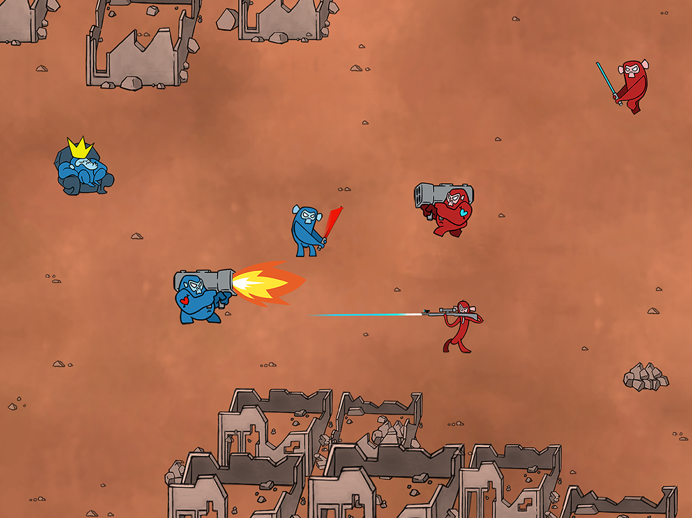

# Cheating Monkeys
_InnoGamesJam 2016_
Theme: Time Cheating

# What's the game about
Turn based strategy game with a board, you will have a set of units that will move across the board. Units will attack each other when in range, at the end of the turn.

This is a game in which it is important to anticipate the movements of your opponent.

## How to win
 - Defeat the king of your opponent

## Types of units
 - King
 - Melee
 - Ranged
 - Heavy

## How does a turn work
 1. Both players select the movements that their units will do
 2. Both players press ready and wait for the other to finish
 3. Display what will the result be
 4. Both players can slightly revert the time on some of their units
 5. Finish a turn
 6. The units will show the result at the same time to both players and resolve the attacks

# Controllers
 - Mouse or finger

# Contributors
 - Daniel Lupiañez
 - Dennis Bliefernicht
 - Erik Frey
 - Giancarlo Dessena
 - Jan Becker
 - Marta Viader
 - Oriol Ribas
 - Sergio R. Lumley

 [logo]: relative/path/to/img.jpg?raw=true
